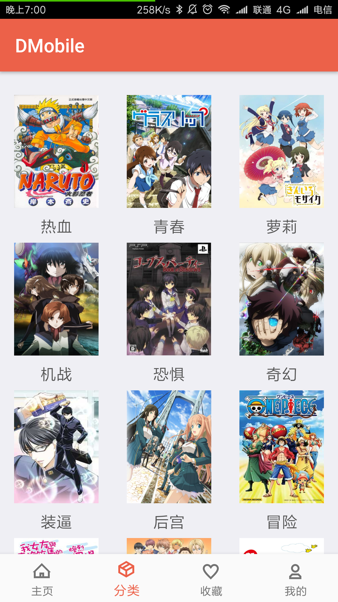
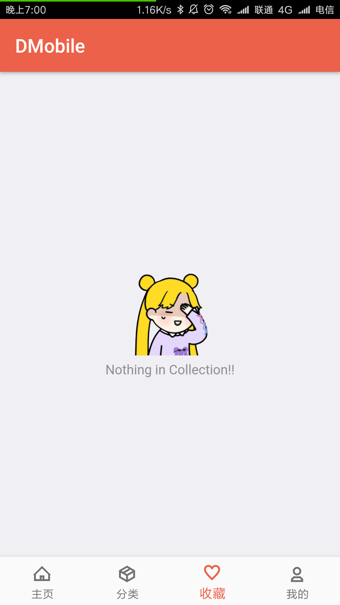
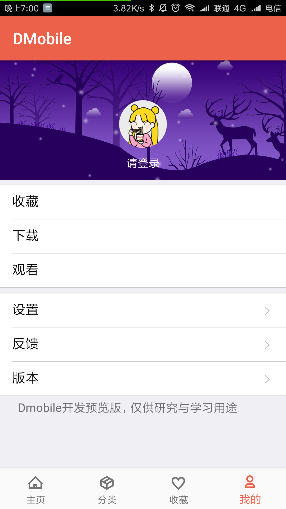

# DMobile

#### 项目介绍

表现层使用html5，底层使用原生java的高性能动漫app
目前还有许多没有解决的问题 ，主要是html5在web容器中的加载速度、资源复用。
等一下，在去写

#### 软件架构
软件架构说明

> 表现层：MUI  
> 底层：原生java

#### 安装教程

>  适用于安卓4.0以上

#### 使用说明

 
 
 

#### 参与贡献

1. Fork 本项目
2. 新建 Feat_xxx 分支
3. 提交代码
4. 新建 Pull Request

#### 主要特性

> HTML5渲染用户界面  
> 底层原生java的缓存管理架构
